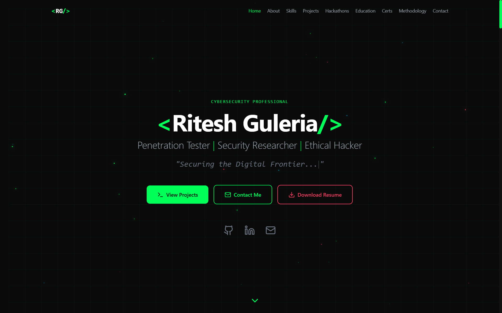

<p align="center">
  
</p>

<h1 align="center">Gundu Hemanth — Cybersecurity Portfolio</h1>

<p align="center">
  <strong>A sleek, responsive portfolio &amp; <em>second brain</em> for a Cybersecurity Specialist &amp; Penetration Tester</strong>
</p>

<p align="center">
  
  
  
  
  
</p>

---

## 📸 Preview



---

## ✨ Highlights

| Feature | Details |
|---------|---------|
| **Single-Page App** | All sections live in one smooth-scrolling page with intersection-based active nav |
| **Dark Cyber Theme** | Neon green (`#00ff41`), electric blue (`#00d9ff`), and crimson (`#ff3864`) accents on a `#0a0a0a` canvas |
| **Framer Motion** | Fade-in, stagger, and scroll-based animations for every section |
| **Fully Responsive** | Mobile-first layout with a hamburger menu and adaptive typography |
| **Contact Form** | Powered by [Formspree](https://formspree.io/) with email domain validation, HTML sanitization, and client-side rate limiting |
| **TryHackMe Card** | Compact inline profile card linking to TryHackMe stats |
| **Scroll Progress Bar** | A fixed top bar showing page scroll percentage |

---

## 🧠 Second Brain

Beyond a showcase of work, this site doubles as a **second brain** — a living, personal knowledge base that captures and connects everything I learn as a security practitioner:

- **Connected Notes** — atomic, interlinked notes on pentesting techniques, vulnerabilities, and tooling so concepts reinforce each other instead of living in isolation.
- **CTF & Lab Write-ups** — battle-tested methodology from TryHackMe, HackTheBox, and live engagements, written to be re-found and re-used later.
- **Research & Reading** — curated summaries of CVEs, papers, and blog posts with my own actionable takeaways.
- **Searchable Memory** — the portfolio acts as an external memory I can query on demand, turning scattered learning into a retrievable system.

The goal is a single, portable brain: one place for projects, proof of skill, and the accumulated reasoning behind them. (Notes can be wired in via Obsidian/Markdown or a graph-backed store — drop your vault or knowledge graph into the project and link it from `src/App.tsx`.)

---

## 🗂 Sections

1. **Hero** — Animated intro with *View Projects*, *Contact Me*, and *Download Resume* CTAs
2. **About** — Bio, TryHackMe profile card, and Core Philosophy pillars
3. **Skills** — Categorised skill grid (Web App Security, Network Security, Offensive Security, Security Tools, Programming, ML/AI)
4. **Projects** — Placeholder for upcoming security projects (add your own in `src/App.tsx`)
5. **Experience** — GDG Core Member, IOTA Core Member, Pycon 2025, Abhisarga'26
6. **Education** — B.Tech (Hons.) CSE @ IIIT Sri City
7. **Certifications** — eLearnSecurity Junior Penetration Tester (eJPTv2)
8. **Methodology & Ethics** — Six-phase pentesting methodology with an ethics commitment
9. **Contact** — Formspree-powered form + social links

---

## 🛠 Tech Stack

| Layer | Technology |
|-------|------------|
| UI Framework | React 19 |
| Language | TypeScript 5.9 |
| Build Tool | Vite 7 |
| Styling | Tailwind CSS 3 + tailwindcss-animate |
| Animations | Framer Motion 12 |
| Icons | Lucide React |
| UI Primitives | Radix UI (via shadcn/ui) |
| Form Handling | React Hook Form + Zod + Formspree |

---

## 🚀 Getting Started

### Prerequisites

- **Node.js** ≥ 18
- **npm** (comes with Node) or **yarn**

### Installation

```bash
# 1. Clone the repo
git clone <your-repo-url>
cd cybersecurity-portfolio

# 2. Install dependencies
npm install

# 3. Start the dev server
./start.sh
```

Open **http://localhost:5173** in your browser.

### Build for Production

```bash
npm run build      # TypeScript compile + Vite build
npm run preview    # Preview the production build locally
```

The optimised output is written to the `dist/` directory.

---

## 📁 Project Structure

```
├── public/
│   ├── favicon.svg         # Custom <GH/> SVG favicon
│   └── resume.pdf          # Downloadable resume
├── src/
│   ├── components/ui/      # shadcn/ui primitives (button, card, dialog, etc.)
│   ├── hooks/
│   │   └── use-mobile.ts   # Responsive breakpoint hook
│   ├── lib/
│   │   └── utils.ts        # Tailwind merge helper (cn)
│   ├── App.tsx             # Main single-page application
│   ├── index.css           # Tailwind directives + custom styles
│   └── main.tsx            # React DOM entry point
├── index.html              # HTML shell with favicon
├── start.sh                # Quick start script
├── tailwind.config.js      # Tailwind theme & plugins
├── vite.config.ts          # Vite configuration
├── tsconfig.json           # TypeScript config (root)
├── tsconfig.app.json       # TypeScript config (app source)
├── tsconfig.node.json      # TypeScript config (node/vite)
├── eslint.config.js        # ESLint flat config
├── postcss.config.js       # PostCSS (Tailwind + Autoprefixer)
├── components.json         # shadcn/ui configuration
└── package.json
```

---

## 🎨 Design Tokens

| Token | Value | Usage |
|-------|-------|-------|
| Primary Green | `#00ff41` | Accents, CTAs, skill highlights |
| Electric Blue | `#00d9ff` | Secondary accent, live-demo links |
| Crimson Red | `#ff3864` | Warnings, resume button, emphasis |
| Background | `#0a0a0a` | Page background |
| Surface | `#111111` / `#1a1a1a` | Section & card backgrounds |
| Text Primary | `#e0e0e0` | Body text |
| Text Muted | `#9ca3af` | Subtitles, descriptions |

---

## ⚙️ Configuration

### Contact Form (Formspree)

The contact form submits to a Formspree endpoint. To use your own:

1. Create a form at [formspree.io](https://formspree.io/)
2. Replace the endpoint URL in the `ContactSection` component inside `src/App.tsx`:
   ```tsx
   const response = await fetch('https://formspree.io/f/YOUR_FORM_ID', { ... });
   ```

### Resume

Replace `public/resume.pdf` with your own resume file.

### TryHackMe

Update the `publicId` and username in the `AboutSection` of `src/App.tsx` to reflect your own TryHackMe profile.

---

## 🚢 Deployment

The site can be deployed on **Vercel**, **Netlify**, **Cloudflare Pages**, or **GitHub Pages**:

1. Push to GitHub
2. Import the repo on your preferred platform
3. Deploy on every push

---

## 📜 License

This project is open-source. Please ensure you have the right to use and publish any third-party code included in this project.
